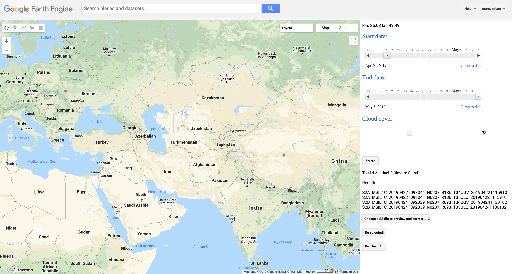

# [SIAC on GEE](https://code.earthengine.google.com/30176ec6495fd7d1d91f633ff34f1bbb)
### Feng Yin
### Department of Geography, UCL
### ucfafyi@ucl.ac.uk

[](https://zenodo.org/badge/latestdoi/185251518)
[](https://zenodo.org/badge/latestdoi/117815245)


This is the GEE version of [SIAC](https://github.com/MarcYin/SIAC), under the intention of utilizing the power of GEE servers and wide variety of data. It has a simple UI based on the GEE UI APIs, which has the ability to search available Sentinel 2 images based on point clicked on the map, defined date range and cloud coverage, and correct for selected one image tile or do AC for all of them.


### Usage:

1. Click [here](https://code.earthengine.google.com/b4fb38865be2bfb59f04b93eb415a042) to open the GEE APP;

2. Click `show code` to show the code for the UI, and click `Run` to start the UI;

3. Click over the map top set AOI, using datesliders to set time period and using slider to set cloud cover threshold

4. Click search to get the desired Sentinel 2 images, then choose to `Do AC` for one selected image or for all the results;

5. Cick `Do LAI` to get LAI products for all the results


### Click `RUN` buttons to submit jobs to GEE server:

It is hard to click `RUN` button for every single image, so a piece of code to do it. To use it, you need to press `F12` in your keyboard to open browser console and paste the following code:

Great thanks to [Dongdong Kong](https://github.com/kongdd) for sharing it on [stackexchange](https://gis.stackexchange.com/questions/290771/batch-task-execution-in-google-earth-engine)!
```javascript

/**
 * Copyright (c) 2017 Dongdong Kong. All rights reserved.
 * This work is licensed under the terms of the MIT license.  
 * For a copy, see <https://opensource.org/licenses/MIT>.
 *
 * Batch execute GEE Export task
 *
 * First of all, You need to generate export tasks. And run button was shown.
 *   
 * Then press F12 get into console, then paste those scripts in it, and press 
 * enter. All the task will be start automatically. 
 * (Firefox and Chrome are supported. Other Browsers I didn't test.)
 * 
 * @Author: 
 *  Dongdong Kong , 28 Aug' 2017 
 *      Sun Yat-sen University
 */

function runTaskList(){
    var tasklist = document.getElementsByClassName('task local type-EXPORT_IMAGE awaiting-user-config');
    for (var i = 0; i < tasklist.length; i++)
            tasklist[i].children[2].click();
}
// confirmAll();
function confirmAll() {
    var ok = document.getElementsByClassName('goog-buttonset-default goog-buttonset-action');
    for (var i = 0; i < ok.length; i++)
        ok[i].click();
}
runTaskList();
confirmAll();
```

### Reference:

Yin, F., Lewis, P. E., Gomez-Dans, J., & Wu, Q. (2019, February 21). A sensor-invariant atmospheric correction method: application to Sentinel-2/MSI and Landsat 8/OLI. https://doi.org/10.31223/osf.io/ps957

An example UI:

  

### LICENSE
GNU GENERAL PUBLIC LICENSE V3
